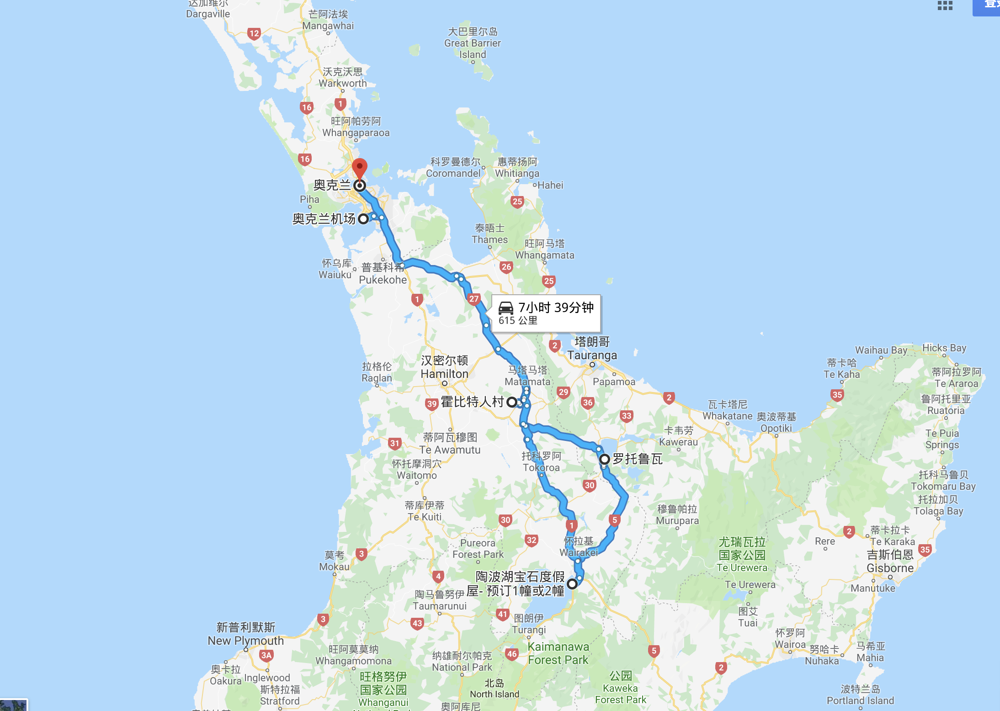

# 新西兰初探

## 线路规划

## *北岛*

### D1 杭州HGH - 奥克兰AKL

- 港龙航空（Airbus A320 小型机 一排六座 中间过道） KA627 杭州（11:15）-香港（13:40）
- 国泰航空/新西兰航空（Airbus A350-900 大型机 两条过道） CX199/NZ4992 香港（15:20）-奥克兰（7:25）

### D2 奥克兰机场 - 霍比特村 - 罗托鲁阿Polynesian Spa

#### 奥克兰机场取车

#### 霍比特屯

游玩霍比特屯之前，一定要先了解电影 [魔戒三部曲](https://zh.wikipedia.org/wiki/%E9%AD%94%E6%88%92) 和 [霍比特人](https://zh.wikipedia.org/wiki/%E9%9C%8D%E6%AF%94%E7%89%B9%E4%BA%BA%E7%94%B5%E5%BD%B1%E7%B3%BB%E5%88%97)  这个景点就是剧中霍比特人的故乡-夏尔（Shire）。

夏尔的由来： 在[彼得·杰克逊](https://zh.wikipedia.org/wiki/%E5%BD%BC%E5%BE%97%C2%B7%E5%82%91%E5%85%8B%E6%A3%AE "彼得·杰克逊")执导的《[魔戒电影三部曲](https://zh.wikipedia.org/wiki/%E9%AD%94%E6%88%92%E9%9B%BB%E5%BD%B1%E4%B8%89%E9%83%A8%E6%9B%B2 "魔戒电影三部曲")》里，夏尔出现于第一部《[指环王：护戒使者](https://zh.wikipedia.org/wiki/%E9%AD%94%E6%88%92%E9%A6%96%E9%83%A8%E6%9B%B2%EF%BC%9A%E9%AD%94%E6%88%92%E7%8F%BE%E8%BA%AB "指环王：护戒使者")》和第三部《[指环王：王者归来](https://zh.wikipedia.org/wiki/%E9%AD%94%E6%88%92%E4%B8%89%E9%83%A8%E6%9B%B2%EF%BC%9A%E7%8E%8B%E8%80%85%E5%86%8D%E8%87%A8 "指环王：王者归来")》。1999年，拍摄团队于[新西兰](https://zh.wikipedia.org/wiki/%E7%B4%90%E8%A5%BF%E8%98%AD "新西兰")的[马塔马塔](https://zh.wikipedia.org/w/index.php?title=%E9%A6%AC%E5%A1%94%E9%A6%AC%E5%A1%94&action=edit&redlink=1)开始搭建夏尔哈比屯的场景，但随着电影拍摄结束夏尔的场景也随之拆除。不过由于魔戒电影系列的名气，还是让该地成为知名观光景点。

2012年彼得·杰克逊开始拍摄的魔戒前传**霍比特人电影系列**里，夏尔再度出现在《[霍比特人：意外旅程](https://zh.wikipedia.org/wiki/%E9%9C%8D%E6%AF%94%E7%89%B9%E4%BA%BA%EF%BC%9A%E6%84%8F%E5%A4%96%E6%97%85%E7%A8%8B "霍比特人：意外旅程")》片头和《[霍比特人：五军之战](https://zh.wikipedia.org/wiki/%E5%93%88%E6%AF%94%E4%BA%BA%EF%BC%9A%E4%BA%94%E8%BB%8D%E4%B9%8B%E6%88%B0 "霍比特人：五军之战")》结尾。夏尔取景地依旧在马塔马塔的同一处，由木材和石头的坚固材质建造。在电影结束拍摄后，该处即作为永久的旅游景点“[哈比村](https://zh.wikipedia.org/wiki/%E5%93%88%E6%AF%94%E6%9D%91 "哈比村")”（Hobbiton Movie Set）开放给来自全球的游客，为新西兰带来观光收入。

#### 波里尼西亚温泉[Polynesian Spa](https://www.polynesianspa.co.nz/)

- 波里尼西亚温泉由石砖及木块分割成一个个小池，每个都有不同温度选择，温度在摄氏36度至42度，不同的水温有不同的疗效。 
- 波里尼西亚温泉有全球十大温泉之一的美称，内部不设酒店住宿，仅是温泉，营业时间至晚上11点。

### D3 怀奥塔普地热世界(Wai-O-Tapu Thermal Wonderland) - 陶波湖 - 奥克兰市区

“罗托鲁阿”是毛利语，意为“双湖”

#### 怀奥塔普地热世界(Wai-O-Tapu Thermal Wonderland)

#### 陶波湖（Lake Taupo）

### 南岛

#### 凯库拉

- 观鲸

凯库拉的观鲸游一定要提前预定、提前预定、提前预定！网址http://www.whalewatch.co.nz/

凯库拉观鲸公司 (Whale Watch® Kaikoura) 是新西兰唯一可以全年带领游客在自然环境中近距离观赏世界上最大的有齿掠食性动物——巨型抹香鲸的海上观鲸公司。观鲸公司不能保证能够邂逅抹香鲸，但是游船出海后看到它们的成功率高达 95%，若您在旅程中没有一睹巨鲸风采, 我们承诺将款项的 80% 退还于您。

- 沿着海滨步道，可以看海豹

#### 特卡波湖

- 一定要提早预定中文观星团，晚上上山去看星空

从约翰山下来开车到库克山，这段路程是我有史以来见过的最美湖畔道路，来新西兰一定要走这段路普卡基湖的美景无论从哪个角度看，都是一幅画作

- 从普卡基湖到库克山的路上有一个可以做直升机游览库克山区的飞机场，进去直接预定即可

- 库克山国家公园

#### 瓦纳卡湖

体验飞行真的十分推荐，有好几个公司，我们预定的是  LEARN TO FLY 的  ，服务不错，自己操作挺多的，教练只是从旁修正，如果操作技能好的话，教练基本都不会管。我飞的时候，只是着陆时教练修正较多。
 预定网址https://www.learntoflynz.com/trial-flights

#### 福克斯冰川

我们由于带着小孩无法冰川徒步，预定的飞双冰川并着陆，冰川从下面看较脏，徒步去了意义也不大，还是飞上去徒步或者观光比较好

预定网址  http://www.glacierhelicopters.co.nz/fox-glacier/

#### 皇后镇

皇后镇，瓦纳卡都可以跳伞，景色都很美，皇后镇的NZONE是双人跳伞发明者，费用稍高点，客人非常多，有9000,12000,15000英尺三种，个人感觉3种高度差别不大，出舱门瞬间失重感明显，过几秒身体就适应了，其实没有想象中刺激。集合后将客人送到郊区一处农场基地，分批乘飞机跳伞。
NZONE预定网址  www.nzoneskydive.co.nz

## 签证

## 租车

#### 租租车

分别在南北岛租了两次车，在国内的租租车网站下的单，EUROPCAR 的车，南岛15天，北岛2天，两次都是机场取还，取车点都在机场出口，直接出示提车单取车相当方便，更惊喜的是，价格居然比EUROPCAR官网便宜，并且两次都被升级了，真是人品啊~~
租租车的服务也是真不错，几次出国都是这里租的车，免费送了国际驾照翻译件，以前都是去公证处公证，但公证已经过期了。其实开始还挺担心这个不能用，结果完全没问题，以后再也不用去公证处排队还花钱了，呵呵

## 电话卡

### 参考

- [带着宝宝去跳伞-新西兰，2017年夏](http://www.mafengwo.cn/i/6795074.html)

