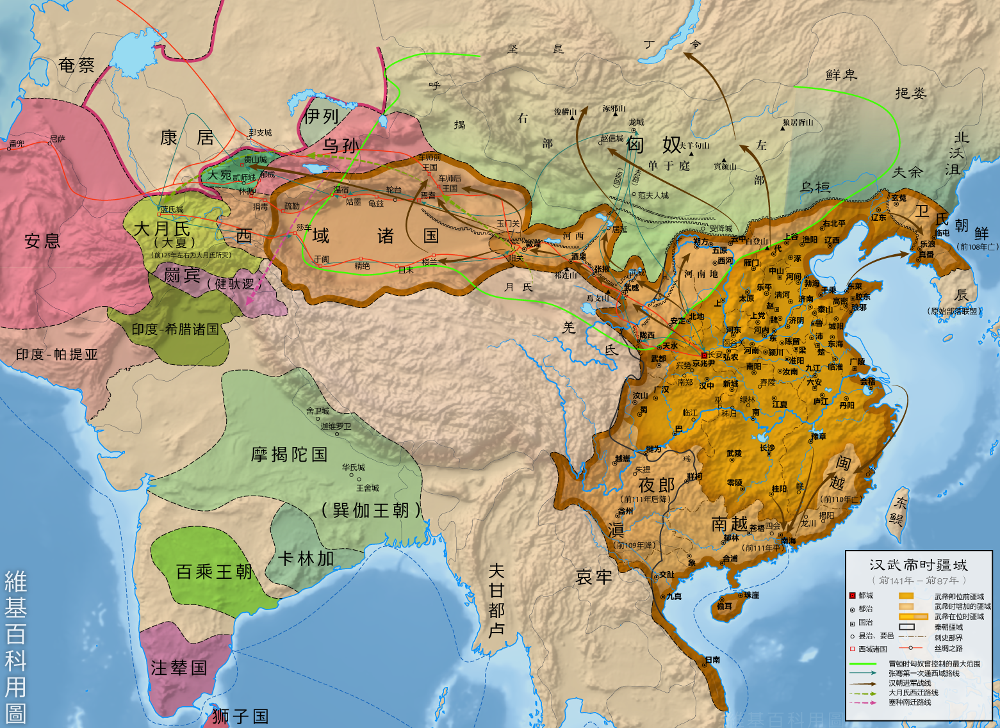

## 历史人文

汉朝开始，将大一统指向西域。包括新疆天山南北的广袤地区，从汉代到清朝晚期都被称为 **"西域"**。 西汉前夕，西域被匈奴控制，并频繁进犯中原。秦始皇修建长城的最初目的就是防匈奴。

公元前138年，汉代张骞出使西域，计划联合大月氏阻断匈奴，卫青霍去病讨伐匈奴，并且在河西走廊设置武威、张掖、酒泉、敦煌设置河西四郡，加上阳关和玉门关，以"列四郡、据两关"，作为中原进入西域的咽喉。 

匈奴归顺汉王朝后，在轮台地区设立西域都护府，郑吉任首任都护。

之后吐鲁番高昌郡的设立成为西域军政事务的又一个中心，行政建制和中原趋同，也就是现在的**高昌故城**。另外一个[**交河故城**](https://www.sohu.com/a/14101759_116154)是世界上最大最古老、保存最完好的生土建筑城市，也是我国保存两千多年最完整的都市遗迹，唐西域最高军政机构安西都护府最早就设在交河故城，距今2000多年，比高昌故城早很多。

之后西突厥溃败，唐朝将都护府西迁至龟兹，分管龟兹、焉耆、于阗、疏勒四城，史称安西四镇。

武则天又在天山北设立北庭都护府，更加加固了西域的管理。东西交流日益发达。

这里插播跟《长安十二时辰》中烽燧堡之战的关系。烽燧堡之战是唐朝与吐蕃王朝的对决。吐蕃王朝（公元六世纪末到九世纪中期左右）核心地区位于今天的青藏高原，是唐朝的老对手。吐蕃原本无力与唐朝交手，可是公元756年爆发安史之乱，唐朝不得不调回西域各部保护长安，导致边陲防卫空虚，吐蕃趁虚而入，一度攻占了长安，但占领不到15天就被郭子仪带领的勤王部队赶出长安，仅仅两年之后，吐蕃又在灵台西原一带被唐朝和回纥的联军打得大败。

唐朝没落后，西域变成了高昌回鹘、于阗王朝、喀喇汗王朝割据的局面，之后被辽(契丹)统一。之后又被蒙古跨过果子沟，吞灭契丹。

明朝朱棣设立哈密卫，以”忠顺王“制定当地首领，管理西域。

到了清朝，准葛尔首领葛尔丹叛乱，历经康雍乾三朝70多年才平定。之后特设”总统伊犁等处将军“，总管西域。左宗棠奏请光绪设立新疆省，意为"故土新归"，首府定位迪化(乌鲁木齐)。

1949年，新疆和平解放。1950年，组建西北军政委员会，彭德怀任主席，习仲勋、张治中任副主席。

### 历史人物

#### 班超

东汉著名将领、外交家。是开拓和维持汉代与西域关系的重要人物。班超出生在文仕家庭，他是史学家班彪之子、《汉书》 编撰者班固之弟，三人合称“三班”，“三班”其中一班有时还不认为是指班超，而是被认为是指身为历史学家的其妹班昭。但他的成名并不是因为文学成就：班超选择投笔从戎，投身于为汉朝稳固边疆的事业中，成为东汉名将。班超城：位于喀什市东南郊，原为疏勒国宫城，班超以此为基地筑城练兵达17年。为纪念班超，盘橐城又叫班超城。

#### 张骞

字子文，西汉汉中郡成固（今陕西省城固县）人，中国汉代旅行家、外交家、探险家。奉汉武帝之命，从长安出发出使西域，两次被匈奴军队俘虏囚禁，历时11年终于逃回长安复命，从而成功开拓了丝绸之路。因此伟大功绩，汉武帝封张骞为博望侯（取“广博瞻望”之意），故又称张博望，封地博望（今河南省方城县博望镇）。

#### 鸠摩罗什

罗什父鸠摩罗炎出身天竺望族，后至龟兹，生罗什。罗什7岁随母出家，初学小乘，10余岁就被龟兹国王奉为国师。后到罽宾、沙勒，遇到莎车国大乘名僧，改学大乘。博读大小乘经论，名闻西域诸国，在汉地也有传闻。前秦建元十八年（382）苻坚遣吕光攻伐焉耆，继灭龟兹，将罗什劫至凉州。三年后姚苌杀苻坚，灭前秦，吕光割据凉州，罗什随吕光滞留凉州达十六、七年。后秦弘始三年（401）姚兴攻伐后凉，亲迎罗什入长安，以国师礼待，并在长安组织了规模宏大的译场，请罗什主持译经事业。之后十余年间，罗什悉心从事译经和说法。著有《金刚经》、《阿弥陀经》、《大智度论》、《妙法莲华经》等，为中文增加了**菩萨、神通、欢喜、菩提、舍利、涅槃等千余个优美词汇**。

### 影视资料

- [B站：中国新疆之历史印记](https://www.bilibili.com/video/BV1DT4y1P7eV)
- [B站：龟兹龟兹](https://www.bilibili.com/video/BV18x411y7K3)

### 博客文章

- [交河故城](http://www.chinesearchaeology.net/cn/kaoguyuandi/kaogusuibi/2014/0723/46932.html)