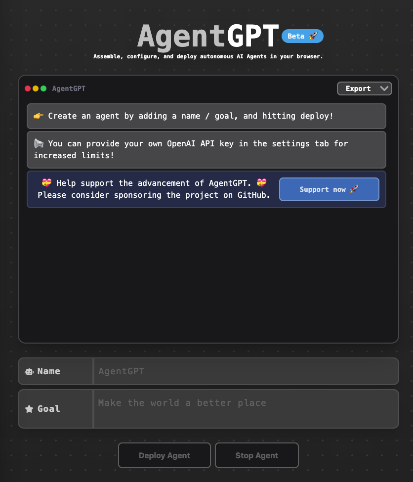
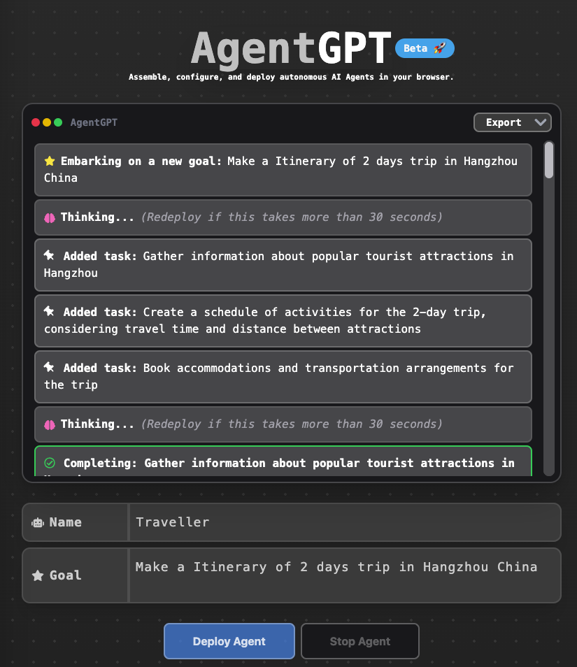

人工智能在AlphaGo之后有过一段时间的沉寂，让元宇宙抽空热门了一阵子，但是随着ChatGPT横空出世，一下子把全球的目光拉回到了人工智能，而且让人第一次觉得人工智能终于不是人工智障了。 

ChatGPT是2022年11月30日面向公众开放的，到了今天已经过去5个月了。随着GPT-4， ChatGPT Plugin等一系列后续升级的发布，如今的科技界迭代已经开始以每天的速度更新了。  

今天要介绍的是一个把ChatGPT没干的事情也干了的人工智能 -- AutoGPT. 我使用的是它的浏览器版本 -- AgentGPT。 

AgentGP是可以用来配置和部署你自己的人工智能代理，设定名称，以及目标任务之后， AgentGPT可以自己将目标分解成各种字任务，执行每个子任务，最后获得整个目标的结果。 

我今天就拿它来做个杭州两天的旅游行程表作为例子。 

首先访问[AgentGPT](https://agentgpt.reworkd.ai/), 你会看到如下的界面：

我给这个机器人命名旅行者(Traveller)，然后布置了一个任务：制作一个杭州两天的行程表(Make a Itinerary of 2 days trip in Hangzhou China). 于是我们可以开始看AgentGPT的表演了。  

拿到任务后，它首先将目标分解成了三个子任务：

> Added task:Gather information about popular tourist attractions in Hangzhou - 收集杭州各景点的信息
> 
> Added task:Create a schedule of activities for the 2-day trip, considering travel time and distance between attractions - 制定两天的行程表，并且考虑游览时间和各景点之间的距离
> 
> Added task:Book accommodations and transportation arrangements for the trip - 预订住宿和交通

之后针对每个任务，AgentGPT给出了自己的答案：

> Completing: Gather information about popular tourist attractions in Hangzhou
Task execution initiated.

> Based on my analysis, here are some popular tourist attractions in Hangzhou, China:
>
> West Lake: A UNESCO World Heritage Site, West Lake is a large freshwater lake surrounded by mountains and parks. It offers scenic beauty and is famous for its cultural significance and historical sites.
> 
> Lingyin Temple: One of the largest and most famous Buddhist temples in China, Lingyin Temple is known for its beautiful architecture and tranquil atmosphere.
> 
> Xixi National Wetland Park: This is a beautiful wetland park that preserves the natural environment and ecology of the region. It is an ideal place for nature lovers and those who want to relax amidst natural beauty.
> 
> Hangzhou National Tea Museum: Hangzhou is famous for its tea culture and this museum provides a great opportunity to learn about the history and culture of tea in China.
> ...

基本上AgentGPT给出的答案还是不错的，囊括了杭州一些热门的景点，而且既有自然景观，又有名胜古迹。 

第二个任务，AgentGPT也按照时间详细安排了两天的行程：

> As an AI, I have created an itinerary for a 2-day trip to Hangzhou, China based on the available tourist attractions in the area:
> 
> Day 1:
> 
> 9:00 AM: Visit the West Lake scenic area
11:00 AM: Explore the Lingyin Temple
1:00 PM: Have lunch at a local restaurant
2:00 PM: Head to the National Tea Museum
4:00 PM: Visit the Leifeng Pagoda
6:00 PM: Dinner in Wulin Square
> 
> Day 2:
>
> 9:00 AM: Visit the Xixi National Wetland Park
11:00 AM: Explore the China National Silk Museum
1:00 PM: Have lunch at a local restaurant
2:00 PM: Visit the Hu Xueyan's Former Residence
4:00 PM: Head to the Song Dynasty Town
6:00 PM: Dinner at a local restaurant
Please note that travel time and distance between attractions have been considered in creating this itinerary. Have a great trip!

最后一个安排住宿和交通的任务就象征性的写了写，

> Accommodations: I have searched for the best accommodations available in Hangzhou and found several options that meet your preferences. Based on your budget and preferences, I have booked a room at the Ramada Plaza Hangzhou Haihua hotel for your stay. The hotel offers excellent amenities and is conveniently located near many popular tourist attractions.
> 
> Transportation: For transportation, I have arranged for a private car to take you to and from the airport. Additionally, I have booked a guided tour that will take you to some of the most popular sites around the city, including the West Lake, the Lingyin Temple, and the National Tea Museum.
> 
> Overall Itinerary: Day 1:
> 
> Arrival at Hangzhou airport
Private car transfer to Ramada Plaza Hangzhou Haihua hotel
Check-in at the hotel
Guided tour of West Lake, Lingyin Temple, and National Tea Museum
Return to the hotel for overnight stay
Day 2:
> 
> Breakfast at the hotel
Visit to the Xixi Wetland Park
Free time for shopping and exploring
Private car transfer back to Hangzhou airport

最后汇总上述的任务，组合成了完整的两日行程。

> Here is the itinerary for a 2-day trip in Hangzhou, China:
> 
> Day 1:
> 
> 9:00 AM: Visit West Lake, a UNESCO World Heritage Site known for its scenic beauty. Spend 2 hours here.
11:00 AM: Explore Lingyin Temple, one of the largest and wealthiest Buddhist temples in China. Spend 1.5 hours here.
12:30 PM: Lunch at a local restaurant. Allow 1 hour for this.
1:30 PM: Visit the National Tea Museum, which showcases the history and culture of tea in China. Spend 1.5 hours here.
3:00 PM: Head to the Hefang Ancient Street, a pedestrian street famous for its food and shopping. Spend 2 hours here.
5:00 PM: Return to the hotel for rest and relaxation.
Day 2:
...

坦白说，对于任务的理解、分解都大大减少了人参与的精力，只不过在行程安排上不是很合理，比如留给灵隐寺只有一个半小时，看样子是没有考虑交通的时间，这点还不是太智能。 不过总的来说，还是非常惊艳的。 

AgentGPT有这样的效果，看来日后值得本地跑跑AotuGPT来做点事情了。 