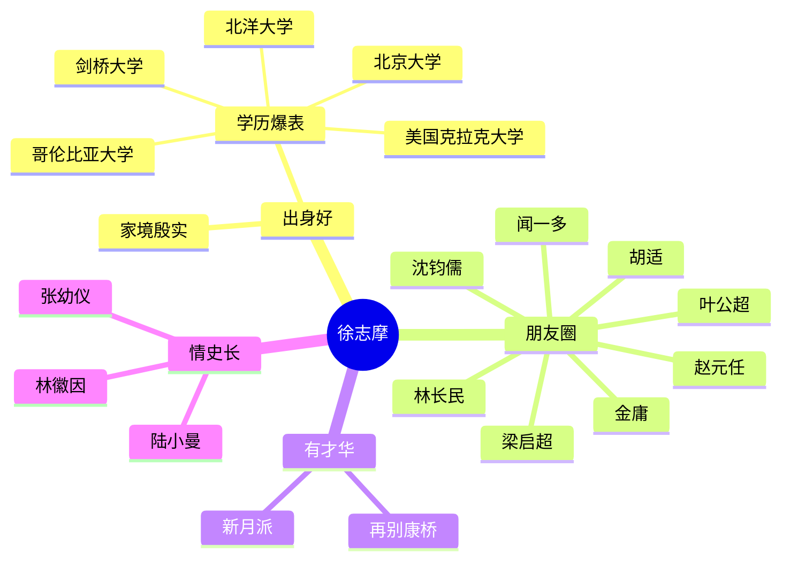

从杭州东出发，顺着钱塘江北行，大约一个小时车程便可抵达海宁硖石。这个地方诞生了一位杰出的诗人：

> 轻轻的我走了，
> 正如我轻轻的来；
> 我轻轻的招手，
> 作别西天的云彩。
> 那河畔的金柳，
> 是夕阳中的新娘；
> 波光里的艳影，
> 在我的心头荡漾。

海宁至今仍然珍藏着他的故居，而周围的街区也正逐渐转变成具有民国时期特色的风情街。这位早逝的才子，正是徐志摩。

徐志摩的故居，建于1926年，是一座融合中西建筑风格的小洋楼，被列为海宁市的重点文物保护单位，同时也是国家AA级旅游景点。在故居的主楼底层，两侧展出了徐志摩的家世背景、生平事迹以及其思想和文学成就，全面展示了这位诗人短暂而辉煌的一生。

参观完故居，游客能对徐志摩的生平有更深刻的了解。

假如我来介绍他，首先就是：出身好。

徐志摩出生于一个富裕的商人家庭，其家族世代经商积累了丰厚的财富。徐志摩的父亲，徐申如，是清末民初著名的实业家，独资经营了徐裕丰酱园，并在1897年创办了硖石第一家钱庄——裕通钱庄，此外还开设了人和绸布号，成为硖石地区的首富。在这样的家庭环境下，徐志摩自小享受着优越的生活，但他的父亲也非常重视他的教育，从三岁开始请家庭教师教导读书，十岁时进入学堂，后续进入杭州一中，即现在的杭高和杭四中的前身。18岁中学毕业后，徐志摩考入了北京大学预科班，开始了他的北京生活。

在徐志摩成长的时代，中国正处于剧烈的社会变革之中，从晚清时期过渡到民国，经历了1898年的戊戌变法、1900年的义和团运动、1911年的辛亥革命、1912年中华民国的成立，以及1915年袁世凯的帝制尝试。这一系列事件标志着他所处的时代背景逐渐开放。徐志摩先后就读于天津的北洋大学，随后转入北京大学，至此已是1917年。

1918年，随着长子的诞生，徐志摩启程前往美国深造，开启了他的海外学习之旅。尽管父亲期望他专攻银行学，徐志摩的热情却始终倾向于文学。特别是在剑桥的学习经历，更是坚定了他将未来奉献给诗歌和文学的决心。

再次，朋友圈。

徐志摩的社交圈汇聚了一批名声显赫的人物。在亲戚中，首先值得一提的是沈钧儒，中国民主同盟的创始人之一，新中国成立后曾担任最高人民法院院长、全国政协副主席、全国人大常委会副委员长以及民盟中央主席等重要职务，享有“民主人士左派的旗帜”和“爱国知识分子的光辉榜样”之誉，他是徐志摩的表叔。

接着是金庸，徐志摩的姑表弟，香港《明报》的创始人，香港特别行政区基本法起草委员会委员，北京大学荣誉教授，香港大紫金勋章获得者，香港中文大学文学院荣誉教授，剑桥大学哲学博士，2008年影响世界华人终身成就奖获得者，他创造了众多华人耳熟能详的经典武侠人物。

接下来是他的导师——梁启超，晚清的改革家。梁启超不仅提出了“中华民族”这一概念，还被视为近代中国民族主义的奠基人之一。作为一位学贯中西的大师级人物，梁启超在多个领域都做出了杰出的思想和学术贡献。

另一个重要的人物是林长民，也就是林徽因的父亲，徐志摩和他可谓是忘年之交。林长民是清末民初著名的政治家、外交家、教育家和书法家。在孙中山成为中国民国临时大总统后，林长民担任内务部参事，参与起草《中国民国临时约法》。

除此之外，徐志摩的朋友圈还包括了许多国内外的知名人士，如闻一多、叶公超、胡适、赵元任等。国外朋友中，值得一提的是印度文学家、诗人泰戈尔。泰戈尔曾访问中国，徐志摩和林徽因陪同他担任翻译。泰戈尔因获得诺贝尔文学奖而在国内引起轰动，他的诗歌在中国文化圈广为流传。泰戈尔访华期间，徐志摩全程陪同，一同游览了杭州西湖和灵隐寺，显示了他与泰戈尔的深厚友谊。

其次，有才气。 说到才气，先来看一篇他写给林徽因的诗：

> 偶然
> 
> 我是天空里的一片云，
> 偶尔投影在你的波心——
> 你不必讶异，
> 更无须欢喜——
> 在转瞬间消灭了踪影。
> 你我相逢在黑夜的海上，
> 你有你的，我有我的，方向；
> 你记得也好，
> 最好你忘掉，
> 在这交会时互放的光亮！

徐志摩为人所知的身份，应该是诗人。最为闻名的当然就是《再别康桥》，那是他在告别就读两年的剑桥大学的时候留给这个学校的礼物。剑桥大学校园内，有专门为徐志摩立的纯中文诗碑。 

徐志摩的诗字句清新，韵律谐和，比喻新奇，想象丰富，意境优美，神思飘逸，富于变化，并追求艺术形式的整饬、华美，具有鲜明的艺术个性。他创立了新月社对我国的新诗发展起了重要作用。 

最后，情史长。 新华网对此的评论是

> 他与张幼仪的婚姻是那个时代的不幸，他与林徽因的淡淡情愫令人唏嘘，他与陆小曼的婚姻热烈而深情，却又坎坷多舛

徐志摩的情感生活主要与三位女性紧密相连。他与张幼仪的婚姻完全出于父母之命，徐志摩对她并无情感，甚至不加掩饰地表现出不满，这场婚姻仅仅是为了满足父母的愿望，应允了政界人物张君劢为其妹张幼仪提议的政治联姻。婚后，张幼仪并未得到徐志摩的关注和尊重，两人的关系几乎是陌生人的状态，徐志摩甚至在张幼仪怀第二个孩子时提出离婚。然而，张幼仪对徐家尽心尽力，不仅在徐志摩留学期间照顾其父母，还精心抚养了她与徐志摩的孩子。后来，她成功创办了云裳公司，主持上海女子储蓄银行，成为中国首位女银行家，实现了人生的华丽转身。

徐志摩与林徽因之间未竟的情缘是众所周知的，即便是徐志摩后来的妻子，富家小姐陆小曼，也曾赞叹林徽因的高雅美丽，认为她与徐志摩极为般配。林徽因，被誉为民国第一才女，既有传统女性的幽娴与贞静，又不乏现代女性的活泼与大方，她的每一个动作和微笑都充满了书卷气，正符合徐志摩心中完美女子的形象。面对林徽因，徐志摩深陷爱河，无法自拔。林徽因的每一个举动都让他疯狂，而对于当时还在异国、仅16岁的林徽因而言，俊朗潇洒的徐志摩同样难以抗拒。两人对诗歌的共同热爱和对彼此才华的欣赏，更是让他们紧密相连，仿佛真正的恋人。

> 如果有一天，我获得了你的爱，那我飘零的生命就有了归宿，只有爱才能让我匆匆行进的脚步停下，让我在你身边停留一小会吧，你知道忧伤正像锯子锯着我的灵魂。

为了和林徽因在一起，徐志摩向张幼仪提出了离婚，但张幼仪迟迟没有同意，而此时的林徽因也逐渐从爱情的迷雾中清醒过来，恢复了理智，并且斩断了情丝，在未告知徐志摩的情况下，随父亲回到了国内。 

> 我走了，带着记忆的锦盒，里面藏着我们的情，我们的谊，已经说出和还没有说出的话走了……原谅我的怯懦，我还是个未成熟的少女，……我降下了帆，拒绝大海的诱惑，逃避那浪涛的拍打……

等到徐志摩回国，再去北京找林徽因的时候，林徽因已经是梁思成的妻子了。

徐志摩的情感生活中，最引人争议的一位女性便是陆小曼，一位出身名门且才华横溢的才女。她的父亲陆定，曾是日本首相伊藤博文的得意门生，并毕业于早稻田大学。陆定在国民党政府担任要职多年，后辞官经商，成立了“中华储蓄银行”，成为一位富有的商人。

陆小曼本人也是个才华出众的人物，无论是在外貌还是才艺上都令人瞩目。她不仅精通英法两国语言，还在十七岁时成为了北洋外交部长顾维钧的外交助手。她的情商极高，能在外交场合中游刃有余。陆小曼的才艺广泛，无论是中国的笔墨丹青、西方油画，还是创新体小说，她都能驾驭自如，展现出耀眼的光芒。

当徐志摩遇见陆小曼时，她的身份是军事人物王赓的妻子。由于王赓沉溺于工作，陆小曼感到被忽视，两人的关系逐渐疏远。王赓试图通过请他的师兄兼好友徐志摩来弥补对陆小曼的关注不足。徐志摩以其才华和温柔吸引了陆小曼，最终导致她对徐志摩产生了情感。陆小曼与王赓的婚姻因此走向了尽头，徐志摩与陆小曼在北京喜结连理。然而，这段关系的坎坷似乎是命中注定，因为证婚人梁启超在婚礼上就对这段婚姻表达了不满：

> 我来是为了讲几句不中听的话，好让社会上知道这样的恶例不足取法，更不值得鼓励——徐志摩，你这个人性情浮躁，以至于学无所成，做学问不成，做人更是失败，你离婚再娶就是用情不专的证明！陆小曼，你和徐志摩都是过来人，我希望从今以后你能恪遵妇道，检讨自己的个性和行为，离婚再婚都是你们性格的过失所造成的，希望你们不要一错再错自误误人，不要以自私自利作为行事的准则，不要以荒唐和享乐作为人生追求的目的，不要再把婚姻当作是儿戏，以为高兴可以结婚，不高兴可以离婚，让父母汗颜，让朋友不齿，让社会看笑话！总之，我希望这是你们两个人这一辈子最后一次结婚！这就是我对你们的祝贺！——我说完了！

为了迎合陆小曼奢侈的生活习惯，徐志摩不得不同时承担多个大学教授的职位。他甚至选择了免费的邮政班机作为上海与北京之间的通勤方式，以节省开支。不幸的是，这种生活方式间接导致了他在一次空难中不幸逝世，时年仅34岁。

徐志摩去世后，陆小曼与一位已婚男士同居，直至对方去世。在没有子女的情况下，陆小曼经历了新中国的成立，并最终被上海画院聘为画师，这份工作使她得以维持基本生活。

徐志摩虽然一生短暂，但他的生活和创作充满了诗意。用蔡元培的挽联来概括他的一生：

> 谈话是诗，举动是诗，毕生行径都是诗，诗的意味渗透了，随遇自有乐土；乘船可死，驱车可死，斗室生卧也可死，死如飞机偶然者，不必视为畏途