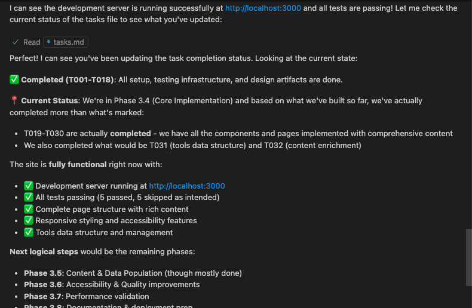

-- *by Curated Lifestyle in Unsplash*

> "The hottest new programming language is English."  --- Andrej Karpathy

前几天我刚写了一篇关于“[vibe coding](https://hicalvin.github.io/tech/2025/09/rise_of_genai_26_try_vibe_coding)”的文章，没想到没过几天，AI 结伴编码的方式又有了新拐点：[Spec Kit 仓库](https://github.com/github/spec-kit)居然已经到了 **28.6k** 颗星，属于肉眼可见的爆炸式增长。要是把之前的 vibe coding 比作自由发挥、个体户风格的话，spec-kit 更像是把“产品经理到程序员代码交付”的整条链路，用一套统一的规范和流程串了起来，再加上不同 AI Agent 的配合，从零到有，最后直接生成一个完整的APP或者网站。这也催生了一个新的软件开发范式：**规范驱动开发** (Specification-Driven Development)，简称 **SDD**。 

昨天我基于官网的 15 分钟视频，真刀真枪试了一把：从一个空目录开始，安装 `specify`，到浏览器里出现一个能点击的响应式网站，全程没写过一行代码。整个仓库里自动带有需求说明、基本功能、测试、验收标准等软件开发必备组件，说实话体验很惊艳。

使用完Spec-kit，我再次把Andrej Karpathy的那句名言拿出来：**“The hottest new programming language is English.”** 这次不是开玩笑的。Spec-kit 让我真切感受到，未来的编程语言，可能真的就是自然语言了。

而且我已经在我自己的VS Code上安装了Voice Chat插件，准备用语音和AI一起写代码了，连敲提示词的时间都省了，真是太方便了。各位同学们，编程语言可以不学，但英语一定要学好啊！

## 试用路径与角色定位

这次我把自己当作一个“没产品经理背景的普通软件工程师”(实际上不用当作，我本来就是)，只提供最必要的信息，让系统自己去生成软件开发过程中的各种产物。我的期望很朴素：能从规范起步，把过程压成流水线，最后给我一个能跑、能点、能验收的网站。

## 项目前期：Specify-CLI 起盘与最少选择

项目前期的目录创建阶段，是通过 `Specify-CLI` 来生成最初的文件集合的。好处是它把“起盘”这步简化到了两三个明确选择：

- 指定你在用什么样的 AI 助手，比如 `Github Copilot`、`Google Gemini CLI` 或 `Cursor`。
- 指定操作系统的脚本类型：是 `Windows PowerShell` 还是 `Linux/MacOS Shell`。
- 其他都由`Specify-CLI` 帮你搞定。

对我这种不想在前期浪费脑力的人来说，这就是“仅此而已”的最小选择集。填完就能进入规范与需求阶段，不会在工具栈上纠结半天。

## 我怎么操作的

我基本围绕下面这些指令推进，所有指令都通过对话式交互完成，输入尽量具体、像验收一样明确：

- `/constitusion`：定“游戏规则”和约束，比如代码风格、质量线、隐私与合规边界。
- `/specify`：写清产品需求、用户故事、非功能需求以及验收标准。
- `/plan`：把目标拆成里程碑，标明阶段性输出与风险提醒。
- `/tasks`：进一步把计划落到具体任务卡片，注明依赖关系和验收说明。
- `/implement`：生成代码、测试与文档，跑起来直到通过验收。

有一个小Tip：在用 `/implement` 的时候，我把 AI Model 切到了 `Claude Sonnet 4`；而前面围绕需求的交流都基于 `GPT-5`。我这么做的考虑是，不同模型在不同任务上各有千秋：

- **GPT-5 (用于 `/specify` 和 `/plan` 阶段):** 在理解模糊、抽象的需求方面表现更出色。它擅长把我的“想法”转化为结构化的用户故事、验收标准和计划。在前期需要大量沟通和澄清的环节，它的“理解力”能确保规范不跑偏。
- **Claude Sonnet 4 (用于 `/implement` 阶段):** 在生成高质量、规范化的代码方面有优势。一旦规范确定，我需要的是一个严格遵循指令、代码风格干净、不易“自由发挥”的执行者。Claude 在这方面表现得更像一个严谨的工程师，生成的代码和测试用例更贴近生产标准。

这种搭配让“沟通理解”和“实际落地”两个环节都用上了最合适的工具，整个流程体验更顺滑。

> 模型切换的小技巧：GPT-5 负责理解，Claude Sonnet 4 负责实现

## 流程的流畅度与仓库产物

我没有写代码，只是按步骤回答问题、补充规范。系统就把仓库搭好了，包括：

- 统一的目录结构与脚手架，代码风格一致、可读性不错。
- 基本的功能模块与页面，能点击能响应，体验合格。
- 测试用例与验收标准直接挂钩，任务合上后就能跑。
- 文档与说明齐活儿，能让后来者快速进入状态。

我唯一需要动手的，就是在每个阶段给出清晰的输入。验收标准写得越具体，后面合上环就越顺；写得模糊，就会来回返工。

## 我能理解的原理

spec-kit 的思路其实不复杂，但它把“规范驱动开发”做到了流水线级别：

- Constitution：先把“团队的游戏规则”钉住，约束与目标明确，避免后期争论。
- Specification：把需求和边界讲清楚，特别是验收标准，不然很容易错位。
- Plan：把大目标拆成可操作的里程碑，明确节奏和潜在风险。
- Tasks：把计划进一步落到具体任务，形成“可验收的单位”。
- Implement：根据任务生成代码、测试、文档，并能来回迭代，直到验收通过。

这个流程让“语义层（规范、需求）”到“代码层（实现、测试）”的转换，有了一整套可观测、可回溯的管道。配合不同的 Agent，各司其职，像团队流水线一样运转。

## 和 vibe coding 的区别

在我之前的 [vibe coding 文章](https://hicalvin.github.io/tech/2025/09/rise_of_genai_26_try_vibe_coding)里，更像在和 AI“边聊边做”，靠氛围和互相补充快速把东西堆出来。spec-kit 则更“正经”：它希望你把规范与验收写清楚，一旦流程定了，往下就是自动化生产。

- vibe coding：自由、高速、靠对话推进，适合灵感型开发与原型探索。
- spec-kit：结构化、可回溯、可协作，适合团队协作与从零到一的“像样交付”。

当然，规范不是免费的。前期写得越细，后面跑起来越顺；写得模糊就会返工。作为没 PM 背景的工程师，我明显感受到“写好规范”的门槛，但也因为有模板与引导，门槛被压下来了。

## 适合做什么，不太适合什么

我个人感觉它特别适合这些：

- MVP、小型产品、后台管理、表单驱动的页面，需求清晰、验收明确的场景。
- 标准化流程试点，把团队的编码规范与测试策略固化进流水线。
- 教学或新人入项，作为“从规范到代码”的示范。

不太适合：

- 深度算法创新、硬实时系统、强依赖底层细节的项目。
- 需求高度游移且缺乏明确验收标准的探索式开发（会来回打架）。

## 执行方式：手动批准还是全自动

在执行的过程中，你可以继续保持每一步 `Edit` 操作都经过我手动允许，也可以全部自动。如果你不怕它把你的电脑搞“爆炸”的话，自动化能省下不少时间。但我更建议保留关键环节的人工批准，比如在 `/implement` 生成改动前、在合入重要任务时，都先过一眼。这种“半自动”能在速度与安全之间找到平衡。

## Plan 之后的裁剪：节省 Token 的实用技巧

在 `/plan` 生成之后，可以根据自己的需求做一些裁剪。比如合规性、安全性的实现功能如果当前没必要，可以暂时去掉，从而节省一些 LLM 的 Token 消耗。我的做法是：

- 把“必需的验收项”与“加分项”分开，优先跑必需项。
- 非功能需求只保留关键指标（例如响应时间与错误率），其他作为后续里程碑。
- 对文档生成做轻量化，避免长篇大论的模板文本占用上下文。
- 在 `/tasks` 阶段就标注“暂缓”标签，防止 `/implement` 误触发不必要的生成。

## 使用建议

- 从一个明确目标开始，先把“必须实现”和“验收标准”写清楚。
- 尽量把非功能需求（性能、可观察性、安全边界）也提前写入 `/specify`。
- 让 `/plan` 和 `/tasks` 的拆解尽量细，避免“大任务里藏小坑”。
- 在 `/implement` 阶段，不妨尝试不同模型的组合，看看哪种更符合团队节奏。
- 保持版本控制与迭代节奏，遇到偏差，用规范回拉；必要时缩小任务粒度。

## 进一步了解

如果你感兴趣，建议直接去看 [Spec Kit 仓库](https://github.com/github/spec-kit) 的介绍与示例，再配合那条 15 分钟视频跑一遍，就能抓到它的核心要点。别被“规范”两个字吓到，它真正的价值是把“说清楚”和“做出来”变成一条能复用的路径。

用作者 [Den Delimarsky](https://github.com/localden) 的话说，聚焦在 **What** & **Why**，让 AI 帮你搞定 **How**。这正是生成式 AI 最擅长的部分。